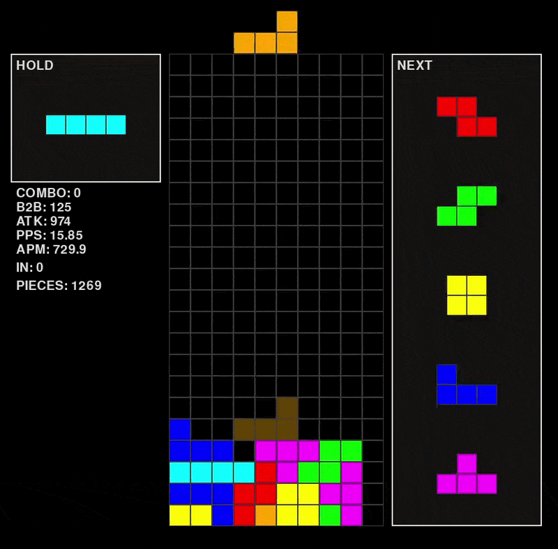
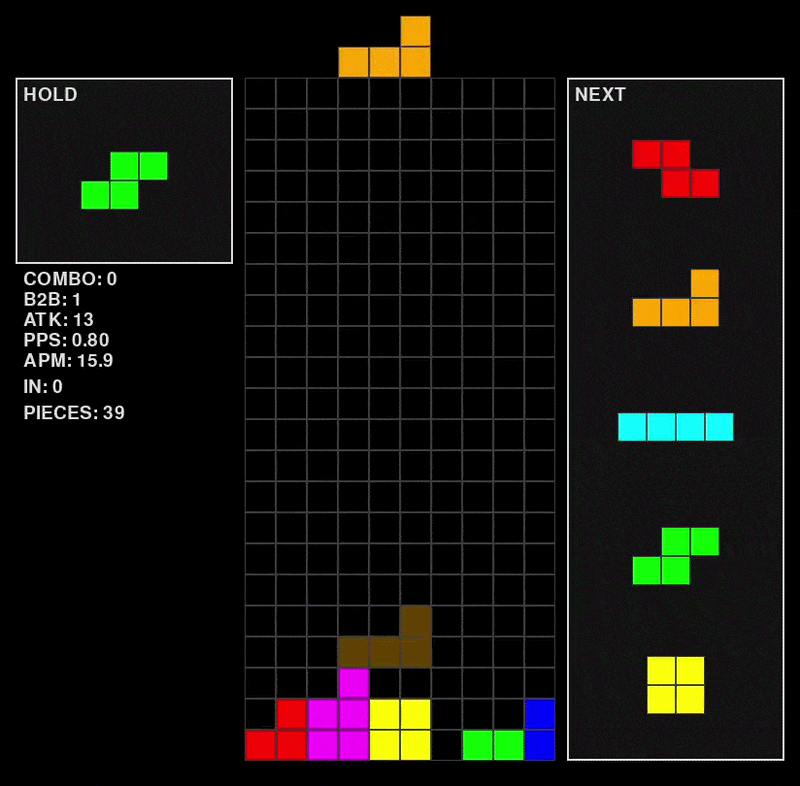
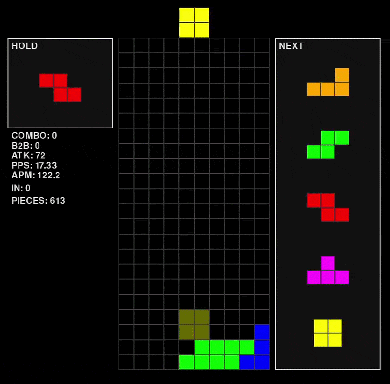
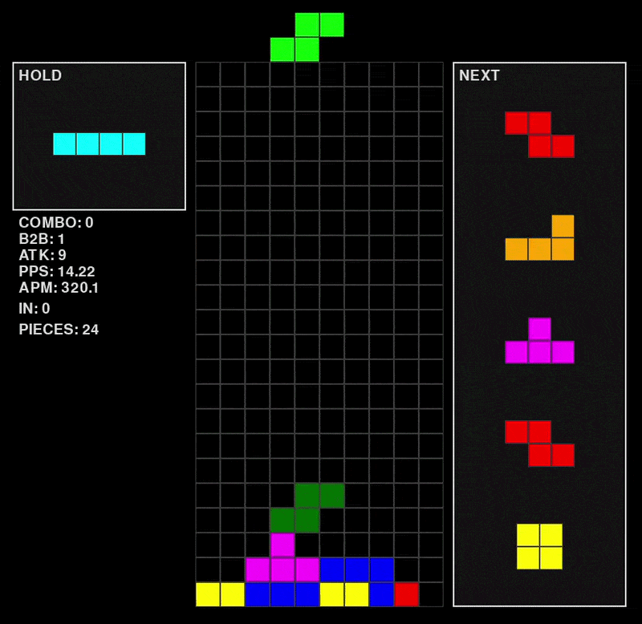
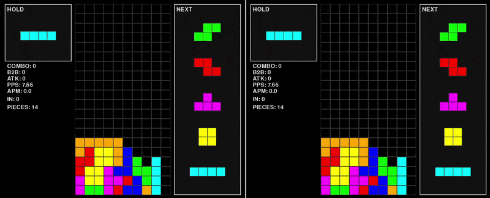

# Opponent-Aware Tetris AI

### Overview

This project explores competitive Tetris AI through heuristic search, evolutionary optimisation, and opponent-aware decision making. The final product contains two AIs that play each other autonomously. One plays under consideration of only it's own game state, while the other also accounts for the opponent's state during the decision-making process.

Unlike traditional Tetris bots that treat Tetris as a single-agent optimisation problem, the opponent-aware agents also extract features from an opponent's game state, and adapts its behaviour accordingly.

---

### Key Features

* Fully playable Tetris implementation
* Multiple AI modes governed under a single AI under a rule-based controller
* Heuristic search for move selection
* Genetic algorithm training pipeline for each mode
* AI vs AI experimentation framework
* Modern Competitive Tetris movement and attack mechanics

---

### AI Agents

#### Baseline AI

A heuristic-based Tetris agent that evaluates board quality using handcrafted features such as:

* Board quality 
    * E.g. Holes, Surface smoothness, Row Transitions etc.

* Line clear events
    * E.g. Singles, Doubles, Tetrises etc.

* Internal counters
    * E.g. B2B multipliers, Pending garbage etc. 

#### Opponent-Aware AI

Extends the baseline by incorporating information about the opponent's board when selecting moves.

---

### Evolutionary Training

Each AI mode is optimised using a genetic algorithm under strategy-specific fitness objectives.

The training pipeline:

1. Generates populations of candidate parameter sets.
2. Evaluates performance through simulated matches.
3. Selects high-performing individuals.
4. Applies crossover and mutation.
5. Repeats over multiple generations.

This allows the manifestation of specific AI behaviours / playstyles according to the defined fitness objective.

---


### Demo

##### AI Modes
Here, we can visualise the stacking behaviours of each AI mode respectively.
<table>
<tr>
<td align="center"><b>Fixed Well (Column 10)</b></td>
<td align="center"><b>Dynamic Well</b></td>
<td align="center"><b>Downstack</b></td>
</tr>
<tr>
<td></td>
<td></td>
<td></td>
</tr>
</table>


#### Dynamic Playstyle
In this setting, the agent continuously evaluates board conditions (under simulated garbage insertion) and switches between the AI modes during gameplay.

<p align="center">
  
</p>


#### AI vs AI Matches
We simulate modern versus Tetris settings, whereby lines cleared on one's board sends a corresponding amount of garbage to the opponent's board.

On the left handside (Player 1), we have the Dynamic AI as previously shown. On the right handside (Player 2), we introduce the opponent-aware agent. Rather than evaluating only it's own board conditions, it also evalutes the opponent's board before deciding which AI mode is most appropriate.


<p align="center">
  
</p>

### Installation

```bash
pip install -r requirements.txt
```

---


### Running the Project

#### AI vs AI Match

Launch a competitive match between the Dynamic Agent and the Opponent-Aware Agent:

```bash
python main.py
```

#### Single-Player Demo
Run a single agent in isolation:

```bash
python -m scripts.single_player_demo
```

This mode is useful for observing agent behaviour without an opponent.


#### Playable Version

To launch the playable version:


```bash
python -m scripts.playable_demo
```

##### Controls

| Action                   | Key             |
| ------------------------ | --------------- |
| Move left                | Left Arrow      |
| Move right               | Right Arrow     |
| Rotate clockwise         | E               |
| Rotate counter-clockwise | W               |
| Rotate 180°              | Q|
| Hold piece               | R               |
| Hard drop                | Space           |
| Exit                     | Esc             |


---


#### Technologies Used

* Python
* Pygame
* Genetic Algorithms
* Heuristic Search
* Bitboards

---

#### Future Improvements

* Reinforcement Learning agents
* Additional search strategies
* Neural evaluation functions

--- 

### Experimental Results

#### Experimental Controls

To estimate the inherent stochastic variance of the environment, a control experiment was performed using symmetric self-play.

| Matchup         | Win Rate  |
| --------------- | --------- |
| Agent vs Itself | 46% / 54% |

The observed deviation from the expected 50/50 split was used as a baseline estimate of environmental randomness arising from piece generation and garbage patterns.


#### Dynamic Mode Switching Outperforms Fixed Strategies

The Dynamic Agent significantly outperformed all fixed-mode variants.

| Fixed Mode      | Win Rate vs Dynamic Agent |
| --------------- | ------------------------- |
| Fixed Well      | 17%                       |
| Flexible Well   | 37%                       |
| Downstack       | 22%                       |

These results demonstrate that no single playstyle dominated in isolation. Agents capable of switching between offensive and defensive objectives consistently achieved higher win rates than agents restricted to a fixed strategy.

#### Opponent Modelling Impact

When compared against an otherwise identical Dynamic Agent, the Opponent-Aware Agent achieved:

| Matchup                                | Win Rate |
| -------------------------------------- | -------- |
| Opponent-Aware Agent vs Dynamic Agent  | 62%      |

The proposed opponent-aware architecture marginally outperformed the standard dynamic agent that did not incorporate opponent state information.
